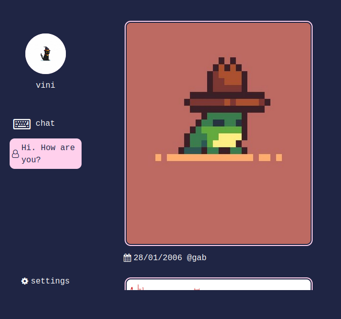

## DuckDuck

by: [v.ii.n.i](https://instagram.com/v.ii.n.i)

    Site made for studies of django framework.

    include:
    * request API
    * base64 images in database
    * font awesome icons

color palette: [colorhunt](https://colorhunt.co/palette/1f2544474f7a81689dffd0ec)

version: 1.3.0

building: feed request images API
